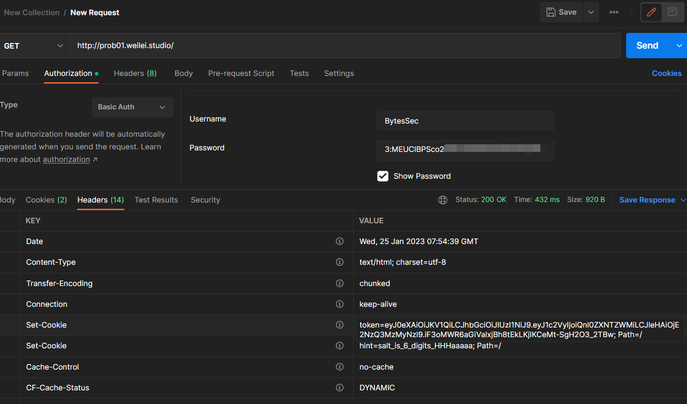
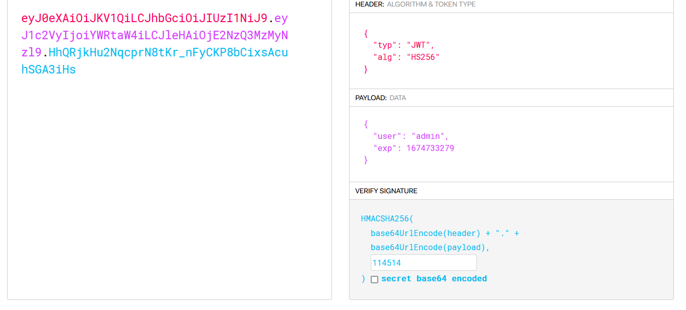
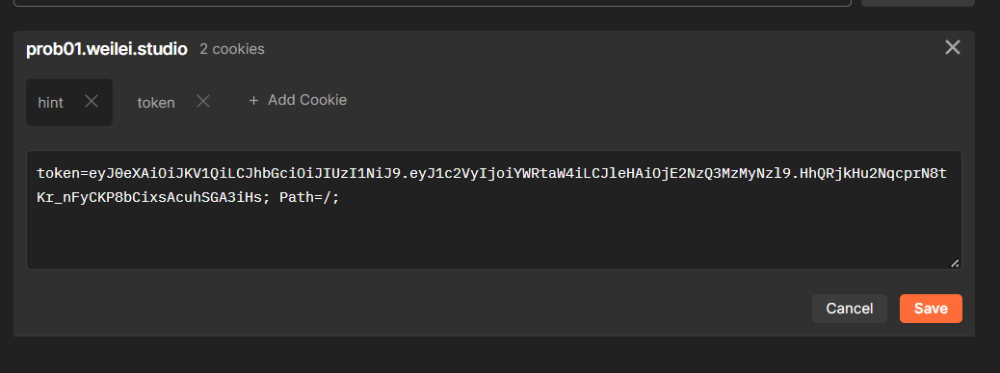
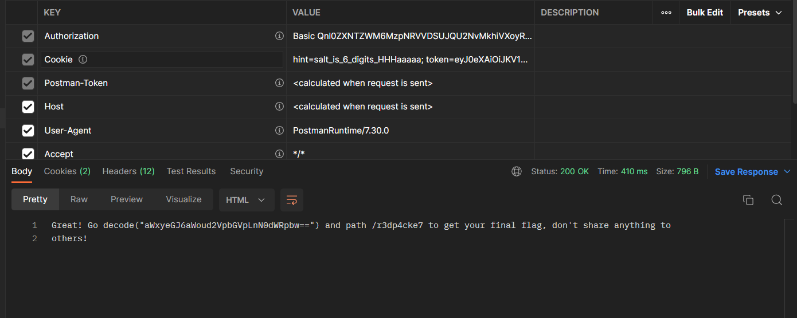
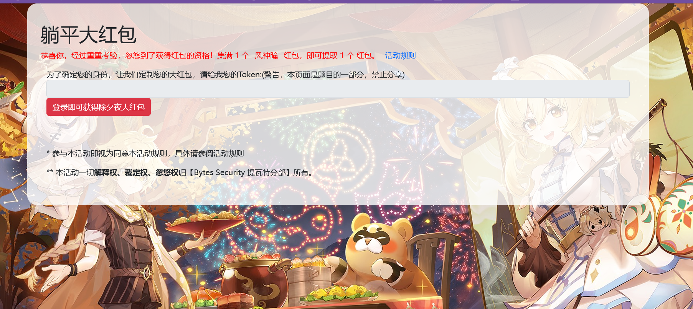
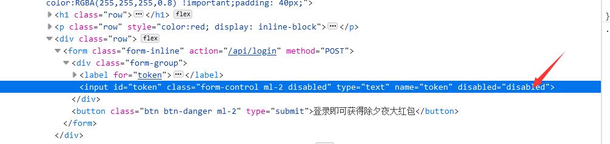
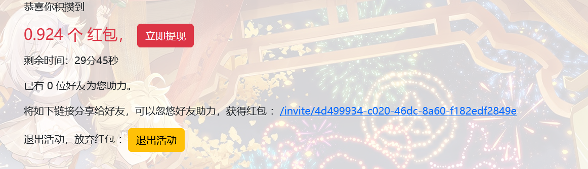

# [Misc] 签到

- 命题人：ZianTT
- 题目分值：100 分

## 题目描述

<p>??️?✔️，但4️⃣《躺平?》4️⃣由BytesSec自主?发?1️⃣款全?CTF?。?发生在1️⃣个被称‍♂️「?赛?台」?幻?4️⃣界，在这?，被?选???将被授予「flag」，导引内[开]➰[摆]??。?将扮演1️⃣位名为「CTFer」?神㊙️角?，在??旅行??逅性格各异、能?独特?群友?，?他?1️⃣7️⃣?败?敌，找回失散?Flag——同?，逐步发掘「屯flag」??相。</p>
<div class="well">
<strong>萌新入门</strong>
<p>
Base64为什么叫Base64呢？有没有Base16，Base32，Base……？
</p>
</div>

**[【附件：下载题目附件（checkin.pdf）】](attachment/checkin.pdf)**

## 预期解法

首先找到这个ARAS系统 F12即可看到

```html
<!-- ARAS domain prob01.weilei.studio -->
```

开始第一阶段的挑战

>"Please Login with username "BytesSec" and password [YOUR TOKEN] although I didn't ask you.(This is part of the challenge, don't share this to others!)"


登录嘛，，，那就直接上BasicAuth



直接进行一个postman的请求   
然后看到给了一个token和hint，臭小子（   
直接盲猜jwt，去jwt.io



改掉cookie



再次请求



base64解码得到这个  https://ilrxbzij.weilei.studio/r3dp4cke7
继续来到第二关



***我朝，O（bushi***



删掉这个disabled
然后登录上去



然后来到pdd式助力环节，当然不是真正的助力，代砍也不能砍到127.0.0.1的ip   
分析助力页面   

**POST：https://ilrxbzij.weilei.studio/invite/90e85f2b-a001-4c4d-973a-6625ab51e11d**   

表单数据是 ip:xx.xx.xx.xx   
直接用curl或者python写脚本批量交就好