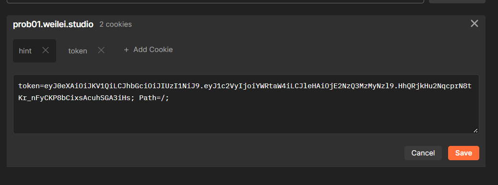

# [Happy2023] Happy2023!

- 命题人：组委会
- 题目分值：500 分

## 题目描述

<div class="well">
<strong>出题人的话</strong>
<br>
<p>下面是某位出题人(n0pe)的一点悄悄话,这次比赛是希望大家从学习和工作中放松出出来，所以出的非常简单</p>
<p>红包也不是很多，毕竟我也很穷，拿着这点钱买个泡泡糖吃或者买点炮放一下也不错</p>
<p>如果你没能拿到红包，也可以看看窗外的烟花，这个免费</p>
<p>希望能让你开心一会</p>
<p>你有多久没有一个人好好放松一下了？一周？一个月？还是你自己都意识不到了？</p>
<p>在这段假期里，好好休息休息吧，陪陪自己的家人，朋友</p>
<p>旅途的意义不是抵达终点，所以不必匆忙，珍惜旅途的每一时刻</p>
</div>
<div class="well">
<strong>出题人的话</strong>
<br>
<p>下面是某位出题人(ZianTT)的一点悄悄话</p>
<p>本次题目的第一关（auth）确实出难了，这里我给大家道个歉</p>
<p>如果让您的做题体验不太好，我真诚地说声抱歉，希望下一届躺平杯你能获得flag</p>
<p>这次一部分红包也是我出的，虽然不多，可能连有些人压岁钱的千分之一都不到</p>
<p>但是，这不就是图一乐吗？过年，就要开开心心滴吖</p>
<p>希望大家都能收获快乐</o>
<p>最后，祝大家新年快乐呐</p>
</div>
<p>今年的解谜，就从主办方<strong>精心</strong>开发的高级红包认证系统ARAS(Advanced Redpacket Authentic System)开始吧~</p>
<p>什么？你问我怎么找到这个系统？你猜捏？</p>
<!-- ARAS domain prob01.weilei.studio -->
<div class="well">
<strong>限时挑战</strong>
<br>
<p>本次活动已经结束，不再发放新红包，相关WP将统一公布至题解仓库。</p>
</div>
<div class="well">
<strong>第二阶段提示</strong>
<br>
<p>更高级的验证叫JWT。</p>
</div>
<div class="well">
<strong>第三阶段提示</strong>
<br>
<p>第二部分入口：https://ilrxbzij.weilei.studio/r3dp4cke7。</p>
</div>

**【红包入口：开始】**

## 预期解法

首先找到这个ARAS系统 F12即可看到

```html
<!-- ARAS domain prob01.weilei.studio -->
```

开始第一阶段的挑战

>"Please Login with username "BytesSec" and password [YOUR TOKEN] although I didn't ask you.(This is part of the challenge, don't share this to others!)"


登录嘛，，，那就直接上BasicAuth


直接进行一个postman的请求
然后看到给了一个token和hint，臭小子（
直接盲猜jwt，去jwt.io


改掉cookie



再次请求


base64解码得到这个  https://ilrxbzij.weilei.studio/r3dp4cke7
继续来到第二关


***我朝，O（bushi***


删掉这个disabled
然后登录上去


然后来到pdd式助力环节，当然不是真正的助力，代砍也不能砍到127.0.0.1的ip
分析助力页面

**POST：https://ilrxbzij.weilei.studio/invite/90e85f2b-a001-4c4d-973a-6625ab51e11d**

表单数据是 ip:xx.xx.xx.xx

直接用curl或者python写脚本批量交就好
