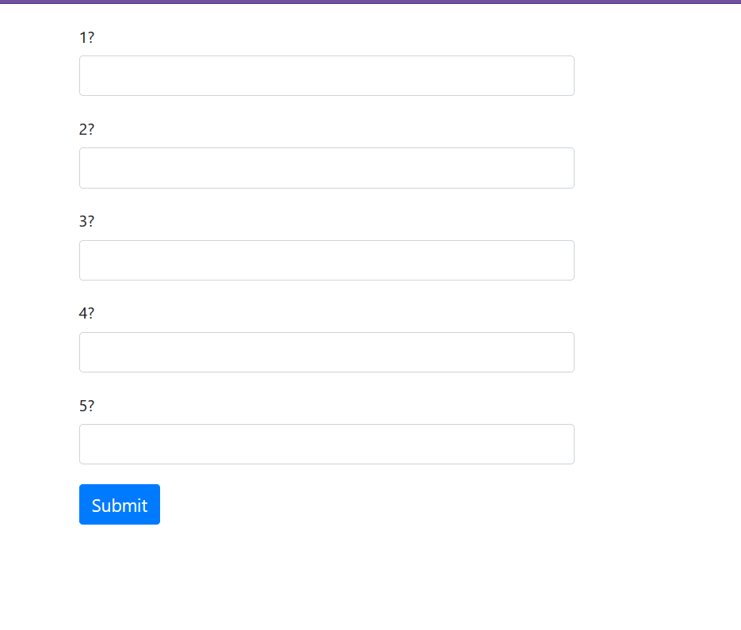
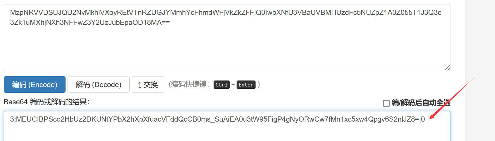
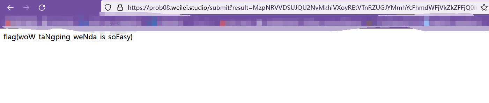

# [Web] 躺平问答 · Beta版

- 命题人：ZianTT
- 基础分值：100 分

## 题目描述

躺平问答，但是是web题目

出题人的电脑被人工智能AGI攻破后，为了惩罚可恶的出题人，人工智能AGI对题目进行了修改，使得用户**不需要做出所有题目**就可以拿到flag

但是由于奇怪的技术问题，服务器出现了某些bug，您可能需要做出你可能需要回答114514道题目才能获得一个一个一个flag啊啊啊啊啊啊啊啊啊啊


## 预期解法



看到这么个玩意，没有题目（也是为了防止有人在这里花的时间太长）


你提交后会被告知你需要做对114514对，新手还在审查元素，老手已经乐死了

```base64
MzpNRVVDSUJQU2NvMkhiVXoyREtVTnRZUGJYMmhYcFhmdWFjVkZkZFFjQ0IwbXNfU3VBaUVBMHUzdFc5NUZpZ1A0Z055T1J3Q3c3Zk1uMXhjNXh3NFFwZ3Y2UzJubEpaOD18MA==
```

看==识base系列，直接丢去看看，发现是base64



直接把0换成114514得到

```
MzpNRVVDSUJQU2NvMkhiVXoyREtVTnRZUGJYMmhYcFhmdWFjVkZkZFFjQ0IwbXNfU3VBaUVBMHUzdFc5NUZpZ1A0Z055T1J3Q3c3Zk1uMXhjNXh3NFFwZ3Y2UzJubEpaOD18MTE0NTE0
```



至此解出flag
