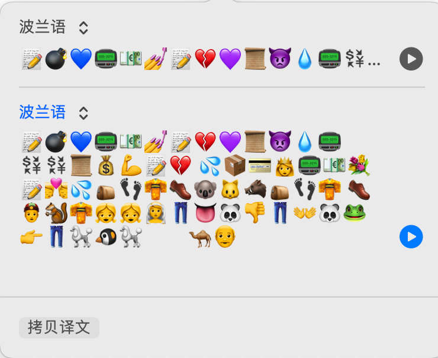
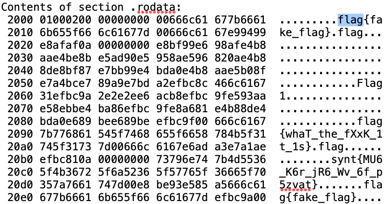

# Xtzzzz

## 签到

下载下来得到一个`tangpingcup.pdf`，edge打开发现是一坨表情包，还不能复制。尝试用预览打开，还是不能复制（~~看来修了这个在`PKUGeekGame`中还可以使用的bug~~），但是发现可以选中文字，所以全选，然后翻译，拷贝译文



消除掉里面的空格之后然后使用[这个网站](http://www.atoolbox.net/Tool.php?Id=937)转了一下就出来了

## 躺平问答

~~比某北问答简单1919810甚至114514倍~~

0. 仔细观察会发现藏有`其实，这题没出错`的字样，`F12`查看网页元素可以看到注释里写了``<!-- 114514*1919810 -->``，计算一下就是答案`219845122340`
1. 关键词：`超文本咖啡壶控制协议`、`冲泡咖啡`、`消息正文的内容类型`。百度一下可以找到[这个页面](https://www.rfc-editor.org/rfc/rfc2324)，里面的2.1.1节`The BREW method, and the use of POST`提到`Commands to control a coffee pot are sent from client to coffee  server using either the BREW or POST method, and a message body with Content-Type set to "application/coffee-pot-command".`
2. 使用Google搜索`google彩蛋`，在[wiki界面](https://zh.m.wikipedia.org/zh/Google%E7%8E%A9%E7%AC%91%E5%92%8C%E5%A4%8D%E6%B4%BB%E8%8A%82%E5%BD%A9%E8%9B%8B%E5%88%97%E8%A1%A8)搜索`leet`得到答案
3. 在比赛主页最下面有一个运行状态，点进去。然后在网页最下面找到`Incident History`，点进去找到答案
4. 在[这个界面](https://github.com/PKU-GeekGame/geekgame-2nd/tree/master/problemset)可以找到每道题的完成人数
5. 随便找个WHOIS查询应该都行，比如[阿里云](https://whois.aliyun.com/)
6. 终端使用`nslookup -type=txt weilei.studio `或者百度一个[域名解析查询网站](https://www.infocode.com.cn/domain/)
7. 百度一个[ASN查询网站](https://tools.ipip.net/as.php)
8. 乐，使用`web.archive.org`，然后就可以看到~~一月十五日和一月九日的怪东西~~
9. 打开[GitHub](https://github.com/)，然后edge点击地址栏的锁查看证书到期日期，记得转成GMT时间

## 二维的码

### flag1

下载得到`flag1.zip`发现有密码，010editor打开修改箭头指向的位置为00，解压得到`flag1.gif`

观察发现是汉信码，但是黑白反了，使用工具反转一下黑白，再使用**中国编码App**扫描得到flag1，和flag2的下载地址

### flag2

故技重施发现不能解压缩，但是在压缩文件内发现了两个文件`download.gif`和`password.gif`，而且`password.gif`的部分是没有加密的，猜测是这个就是密码，删除`download.gif`相关的部分可以解压得到一个残缺的QR Code，去网上找个定位块的图片拼上去就能扫出来，得到密码，解压缩得到`download.gif`，再次使用**中国编码App**扫描得到flag2和flag3的相关地址。


### flag3

地址进去是个二维码，使用**中国编码App**扫描得到flag3的压缩包，解压发现三个条形码，然后打开[某在线条形码阅读器](https://products.aspose.app/barcode/zh-hans/recognize#)，依次读取可以得到`U2FsdGVkX1+QTZuns6phvCNw3MWMReSM3yeB`，`8ZXH4JZBpFxCGu5rDf/2pS4H6w7G0B+1`，`(01)11451419198103`，这个时候注意到题干“兔年的码”，就想到[兔子加密](https://www.sojson.com/encrypt_rabbit.html)（实际上是试了很多加密突然想到的），在网上找一个解码器，扔进去就能得到结果。

## HTTP百解

某人在群里说这是签到题，我刀呢.jpg

### flag1

点进去，F12，看到flag1，没了

### flag2

还没做，好tm难

## 躺平问答·Beta版

点进去，点submit，跳转到`https://prob08.weilei.studio/submit?result=***`，将***位置base64解码发现是你的token｜0，把0改成114514重新访问即可。

乐：在第一次做这个题的时候就尝试了解码，然后眼瞎没看到token后面的0，然后就在错误的方向上不断尝试ing

## 我超，盒

盒盒

下载解压，得到两个jpg，既然要盒，那当然是用exif信息开开试试，百度一个[exif信息查看器](https://exif.tuchong.com/)，照片拖进去，就能看到第一个flag，打开网页，把照片信息填进去得到flag2

## 口算大整数

RSA，但是e很小，可以直接爆破。

```python
import gmpy2

n=0x2fb9f24528a08c1add86ba058bb8c6d6c287f87a1692d59ea047a1f1b3628f5cb06e800b5c6ef02e86cf0df80437d30196e5f9e6508938ccd593894343f1761ddb3acd0b69e591e4845280c2ab0d38285231ae218916b9d9c86f75b2b854c7dfd59b1d46385c41e9d183465424c5d0c26c3fa9ef1ecf456397989dd26ea1823cdec49e72ca14bc3ed7ad5ace4a3499f07048f567aad3092904c3ff8a3b0d0722bf8ce1ffa13cbf39f0a197399f82d8a21ddfde2cd2f38be96510d633316af1b3044fd9d4032a5312a443fc8f3198f695607e5a7360befe869d70bfc239577ec7c0adaf3817a0707624fa4d463ec64b27619f83d221aedb64555f
e=0xa
c=0x6e33c752ca1a0db08ce1552057c2a0f9a8fbed9cabced9b86637fe180b5aaa140a4b0ede5a85000a4a0cb75e7713a840daee6dc54a0bc369d748709f4d363d9dedfdd02638665271b357f154de78d8514bd641fef6eae91cec671d786d5143be295e0e61f32cd56af13e035b5982df4dca15dd773ffc68dd0ab3cc4b081bd1dc37b8c6fc55a9f616879af7ff19b11e5818f7507ae35178763d00f0fef8d400b597aadba2948f158a8cd5f812c312f546b986f2da7fb9c5d64c02b2c988d87b2141242161ef93e5a22b1e9f8bb9b4dd1f468586925ea81df7b3ea57b698c33d4fd6ebf6d292ed34888219b85e847be394ba9607c6ecac399a9

k = 0
while 1:
    res = gmpy2.iroot(k*n+c,e)
    if(res[1] == True):
        print(bytes.fromhex(hex(res[0])[2:]))
        break
    k += 1
```

## V我$\approx 50$

本来写了一个脚本直接根据time.time()发送http请求，然后也过了，但是出题人修了这个非预期解，那就不放wp了（x）

## 躺平flag提取器

根据在某计算机系统导论课上的知识，在终端`objdump -s -d reverseme >111.txt `，直接查看`.rodata`节，就可以得到flag1。同时还发现第一个flag后面跟了一坨``synt{MU6_K6r_jR6_Wv_6f_p5zvat}``，根据经验这玩意就是第二个flag，而且这个形式，就想到了凯撒密码，对字母rot13一下，然后再对数字rot5，就得到flag2。



## 躺平flag提取器·极速板

发现了apk包，`apktool d -s crackme.apk`，`sh d2j-dex2jar.sh classes.dex`，`sh d2j-dex2jar.sh classes2.dex`，`sh d2j-dex2jar.sh classes3.dex`素质四连得到三个.jar，拖到idea里面反编译一下，然后就可以在``classes3.class`里面找到flag1的打乱形式，再根据下面的函数重排列一下，就得到了flag1。

对于flag2，反编译得到的jar中只提供了函数，但是貌似没有写实现，所以考虑去其他地方找找，然后发现了被忽视的`libmain.so`，和上题一样使用`objdump -s -d libmain.so >111.txt `大法，然后就可以在`.rodata`里面找到好东西。

