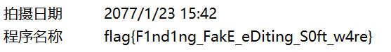

# Bytes 躺平杯 WriteUp

> by hangyi

## 签退

略

## Happy2023!

F12审查元素在网站中找下


访问后提示

> Please Login with username "BytesSec" and password [YOUR TOKEN] although I didn't ask you.(This is part of the challenge, don't share this to others!)

用 Basic Auth 登录


显示

> NO! user is not admin!!!

查看 Cookies 给了 hint: salt_is_6_digits_HHHaaaaa，和一个 JWT Token。

既然说是 6 位数字，联想到主办方，我们可以直接猜测是 `114514`，验证下确实是。改下 user 的值为 admin，替换下 token 


显示

> Great! Go decode("aWxyeGJ6aWoud2VpbGVpLnN0dWRpbw==") and path /r3dp4cke7 to get your final flag, don't share anything to others!

base64 解密为 ilrxbzij，访问 [https://ilrxbzij.weilei.studio/r3dp4cke7](https://ilrxbzij.weilei.studio/r3dp4cke7)

接下来和[FLAG 助力大红包](https://github.com/USTC-Hackergame/hackergame2021-writeups/blob/master/official/FLAG 助力大红包/README.md)几乎一样


先把高亮部分删掉输入 token，然后直接用上面链接提供的脚本就行，只需要换个助力链接而且似乎不用助力255次。

`flag{BytesSec祝大家新年拿大红包吖}`

另：


## 签到

参考隔壁[[Tutorial] †签到†](https://github.com/PKU-GeekGame/geekgame-2nd/tree/master/official_writeup/signin)，可以用[在线解密](https://smallpdf.com/cn/unlock-pdf)，复制出表情符号再 [Base100](http://www.atoolbox.net/Tool.php?Id=937)

`欢迎来到躺平杯！这是flag1: flag{Happy_NEW_YEAR_2023}`

## 躺平问答

> 0.
>
> 其实，这题没出错

审查元素看一看，114514*1919810=219845122340


> 1.当你未授权访问比赛平台后台时(相信我，不要去试，试了会逝)，它会返回一个特殊的状态码，经查证，这个状态码被用于超文本咖啡壶控制协议。当你使用其冲泡咖啡时，消息正文的内容类型是？

未授权状态码是403，这个超文本咖啡壶控制协议查了下找到[RFC 2324（HTCPCP/1.0）](https://datatracker.ietf.org/doc/html/rfc2324)里有提到

```
application/coffee-pot-command
message/coffeepot
```

在[超文本咖啡壶控制协议的茶壶扩展（HTCPCP-TEA）RFC 7168](https://datatracker.ietf.org/doc/html/rfc7168)有提到

```
message/teapot
```

试了下是第一个`application/coffee-pot-command`

> 2.Google在一定情况下会变成leet版本，请问需要访问的地址在'?'后的内容是？

搜下 [google leet版本](http://www.bing.com/search?q=leet%E7%89%88%E6%9C%AC)第一个就是：`hl=xx-hacker` 

> 3.weilei.studio 在赛前进行了一次停机维护，截止至2023-01-15，最后一次维护结束的时间是？（使用CST时间，精确到30分钟）

在[Tangping Cup Status](https://tangpingcup.statuspage.io/incidents/tjkmmxxk8mn4)查到是`Jan 03, 2023 - 23:31 CST`四舍五入就是`2023-01-03T23:30`

> 4.2022 年 PKU-GEEKGAME 的有效参与人数（完成签到题）是？

在[题目列表](https://github.com/PKU-GeekGame/geekgame-2nd/tree/master/problemset)可查到是 567+33=`600`

> 5.bytessec.cc的注册时的域名服务商是？

直接搜[bytessec.cc的Whois信息](http://whois.bugscaner.com/bytessec.cc)，注册商：`NameSilo, LLC`

> 6.weilei.studio 在@域下有个TXT解析，它是？

找个[在线DNS解析](https://www.lddgo.net/network/dns)查下：`welcometo1sttangpingcup`

> 7.weilei.studio的直接解析的IP地址所属的自治系统编号（ASN）是？？

weilei.studio 套了 Cloudflare CDN，Ping 一下 IP 是 172.67.164.34。

搜下[172.67.164.34 ASN](https://ipinfo.io/AS13335/172.67.160.0/20-172.67.164.0/25)：`AS13335`

> 8.截止到 2023 年 1 月 1 日，wearbbs.cn 最后一次被嘿客攻击并挂上黑页的日期是？

去Wayback Machine找到[这个](https://web.archive.org/web/20220115031505/https://wearbbs.cn/)，后面就都在维护了：`2022-01-15`

> 9.程序员最多的地方本次SSL证书过期时间是？

格式要求是 GMT，浏览器显示的可能是 GMT+8，打开 github.com 看下证书


小时数-8=`2023-03-15T23:59:59 GMT`

```
flag{I_dont_KonW_whAT_it_1s}
flag{NEvEr_go0na_g1vE_u_uP}
```

## 二维的码

### 来自理塘的码

压缩包伪加密，改0900为0000解压出来一张图片，看起来有点奇怪，查[维基百科](https://zh.wikipedia.org/wiki/二維碼)的时候发现和汉信码很像，先图片反色，然后[汉信码解码](https://tuzim.net/hxdecode/)

> Good !Flag1: flag{domestic_2D_code} Go /media/boarding_pass.zip

### 你管这叫码？

打开 boarding_pass.zip，其中 password.gif 是不需要密码解压的，补充定位角，扫描出来

> password:ecfbcf7a-0c77-ed48-2e2e-1a993ebd006e

然后用[在线阅读条形码](https://products.aspose.app/barcode/zh-hans/recognize)识别 download.gif

> flag2:flag{L00k_l1k3_bo4rd1ng_p4ss}
> flag3:/media/enterpoint.gif

### 来自兔年的码

识别 enterpoint.gif

> Go /media/c0d3f14g3.zip

解压 c0d3f14g3.zip，分别识别 part1.gif，这里坑在如果用[Dynamsoft](https://demo.dynamsoft.com/barcode-reader/)来识别会不完整

> U2FsdGVkX1+QTZuns6phvCNw3MWMReSM3yeB

part2.gif

> 8ZXH4JZBpFxCGu5rDf/2pS4H6w7G
> 0B+1

pass.gif，这里需要去掉前面的 (01)

> (01)11451419198103

然后将part1、part2拼接`U2FsdGVkX1+QTZuns6phvCNw3MWMReSM3yeB8ZXH4JZBpFxCGu5rDf/2pS4H6w7G0B+1`

兔年[Rabbit解密](https://www.sojson.com/encrypt_rabbit.html)，密码为`11451419198103`

> Flag3:flag{D1fferent_k1nd5_0f_C0D3}

## 神秘的……文字？

### 这么简单

先标准base64解密，再换成 Xxencoding 表解码


或者也可以用 magic 猜


> Congratulations! Here is flag1: flag{e4S1est_cRYpt0_ju5t_Lik3_m1sc}

### 毕加思索

然后是[Bugku CTF 的 BASE100](https://ctf.bugku.com/tool/base100)


全文自只有喵和呜，兽音译者(喵呜版)需要四种字符，猜测是摩斯密码，三个空格应该是单词的分割


整理下

> hey here is flag2 flag em0j1butc4t remember to add braces and all characters are lowercase for next please visit weilei dot studio slash media slash f14g3ofpr0b04 dot html
>
> flag{em0j1butc4t}

### 喵？咕？唔~

访问https://weilei.studio/media/f14g3ofpr0b04.html

用[兽音译者(喵呜版)](https://catt-l.github.io/MeowTranslator/)解密，字典不改好像也能解


再用[Base58解码](http://www.atoolbox.net/Tool.php?Id=932)，好像只能用这个平台，其他解不出来


现在要请上词频分析了，用[quipqiup](https://quipqiup.com/)解


> flag{MiaoGuWu_Tangping}

## HTTP百解

### 神之眼

源码注释里可以看到

> Flag1: flag{Wow_W3b_so_3asY!I_1Ike_Tangp1ng_cuP!}. Remember take your token to get flag2

### 导引内卷之力

> Please request me securely with Bytes Security Browser !

User-Agent 设置成`Bytes Security Browser`

> Hacker! You role isn't admin!

返回了一个`role=ee11cbb19052e40b07aac0ca060c23ee`的 Cookie，[md5解密](https://www.cmd5.com/)下是`user`改成 admin 加密回去`role=21232f297a57a5a743894a0e4a801fc3`

> Please request me with BYTES method!

请求方法修改为`BYTES`

> Please pass me form data
> variable: fruit
> value: (&#39;b&#39;+&#39;a&#39;++&#39;a&#39;+&#39;a&#39;).toLowerCase()
> variable: token
> value: Your Token From weilei.studio

`('b'+'a'+ +'a'+'a').toLowerCase()`执行的结果是`banana`，好像上面少个空格执行不了

用 form-data 发下包就行

> Congratulations!
> Flag:flag{WeLcoMe_To_TangPiNg_Cup_2023}

## 躺平问答 · Beta版

提交下参数多了个 result，base64解码后是

> 你的Token|0

把0改成114514再编码改回去就行，不过要注意不要先把符号给URL编码了

> flag{wow_tangpiNg_Wenda_is_soeAsY}

## WearMe 核心机房 准入验证

###  我去，你怎么在这

使用万能密码username填`admin'–-+`登录

> 登陆成功!Flag1: flag{wo0Ps_H4cker_Is_h3rE}

### 我测，黑客！

用sqlmap直接爆破

```shell
sqlmap -u http://你的前缀.weilei.software/check.php?data=user%3Aadmin --dump
```

然后可以跳过一些选项等待就行，不过很慢，经常崩


> flag{GE7_f14g_from_sq1_Inj3cTi0n}

## 我抄，盒！

### 照片中的flag

查看 date.jpg 的详细信息



> flag{F1nd1ng_FakE_eDiting_S0ft_w4re}

### 网站中的 flag

在 [CyberChef](https://gchq.github.io/CyberChef/#recipe=Extract_EXIF()) 导出 origin.jpg 的 EXIF


> 出题人的设备型号是什么?(全部小写且在适合的位置上加入空格)

Model: ipad mini

> 出题人的设备系统版本是?（仅填写版本号(数字和小数点)，不包含系统名称）

Software: 7.1

> 出题人所在的坐标是?(格式为XX.XXN,XX.XXE)（保留两位即可）

GPS:~~40.95E,100.28N~~ 40.95N,100.28E

> 出题人在发现会通过exif暴漏自己的位置之后又重新修改了一些信息（但又没完全修改），请问篡改的编辑日期是XXXX年?

看第一问，2077

> 请输入6来证明你不是机器人

114514

> flag{1_H4Te_ex1F_meSS4gE}

## 口算大整数

e比较小，小公钥指数攻击，找个脚本跑就行

```py
from gmpy2 import iroot
import libnum
e = 0xa
n = 0x1cc2202d9d1bfeed2109339aa2c1d85be6e31c3322c0350633c8f2a0d7a10328159d481a8fc59f95587d1bf1d8d5a5fffbf2d42479ddacf0088589c3d8399db65553174905f7bea7cb30271add4b189bff1e144d5bf44adc3074d18c6e7b40e21993c427895c63bf59442006d2720a63b89bd0732009052f5927da380cd8fc9a361c5728aff4f1c71472aee154b13d17857b3e571adbf29e4c4cbd34e8d0ae492e864e51eebbbce04794390371e08c4ca829cf69d8c40458dee43d4c274431978260611bdfd5b19a846a1ec42cb990a2830860a6dc9bcd1882bf16c6dbcb8ca3efeb1b2a01c73aad722d642113dec0c77ecf2f0590e9fbee5a93
c = 0x6e33c752c8c1c155b934bcfa66cda7543c184cbbd328f118ded0f8ea139a670627e4e180fd992c6faaafc45c781956e59ec04a0aafeb4ab83f68a6f0fef0e2f349685b2c021a9c8cd0b632f20823f56d89a9d67ecc80acc846acc47fb2fc0e477c9fa0254029c098d162166102b82f19b6c73ce657e197302cd1c4de73f263c90e282db9a35d4dbda5cae86c25d7d0d9b4ef1c50c15d8678089689d69d36572ec47f099548d6a7eff447a6e8944cd4e7f69bd9be050150fe503a50a868041fc9d8778f8f5392b9a71350c1b8b86ac9e4b0f072138a325655239f07ce386dfca28f1180ebf60a7305fb5bac9effbda80abb34ea7aa8ac399a9

k = 0
while 1:
    res = iroot(c+k*n,e)  #c+k*n 开3次方根 能开3次方即可
    if(res[1] == True):
        print(libnum.n2s(int(res[0]))) #转为字符串
        break
    k=k+1

#b'flag{W0w_REa11Y_E4SY_R5a}'
```

## V我≈50

随机数的题目

打开 python，运行题目给的代码输出 target，同时在 1 秒内（时间戳没变）访问题目界面，提交输出的值就行

好像改题的时候试了下时间戳偏移为 +231 了，现在就不知道了

> flag{cr@2y_7hur$d4Y_v!VO50}

## 躺平flag提取器

### 我真的不到啊

用 ida 打开，Shift+F12，字符串中可找到

> flag{whAt_tHE_FXxK_1T_1s}

### 太美丽了家人们

看到了很像 flag 的`synt{Mu6_k6r_Jr6_Wv_6f_P5zvAt}`，反编译看看

找到 ROT13 的函数

```c
__int64 __fastcall ROT13(__int64 a1, __int64 a2)
{
  char *v2; // rax
  char *v3; // rax
  _BYTE *v4; // rax
  _BYTE *v5; // rax
  _BYTE *v6; // rax
  _BYTE *v7; // rax
  char *v8; // rax
  unsigned __int64 i; // [rsp+18h] [rbp-18h]

  std::string::basic_string(a1);
  for ( i = 0LL; i < std::string::size(a2); ++i )
  {
    v2 = (char *)std::string::operator[](a2, i);
    if ( isalpha(*v2) )
    {
      v3 = (char *)std::string::operator[](a2, i);
      if ( tolower(*v3) > 110 )
      {
        v5 = (_BYTE *)std::string::operator[](a2, i);
        std::string::append(a1, 1LL, (unsigned int)(char)(*v5 - 13));
      }
      else
      {
        v4 = (_BYTE *)std::string::operator[](a2, i);
        std::string::append(a1, 1LL, (unsigned int)(char)(*v4 + 13));
      }
    }
    else if ( (unsigned int)(*(char *)std::string::operator[](a2, i) - 48) > 9 )
    {
      v8 = (char *)std::string::operator[](a2, i);
      std::string::append(a1, 1LL, (unsigned int)*v8);
    }
    else if ( *(char *)std::string::operator[](a2, i) > 52 )
    {
      v7 = (_BYTE *)std::string::operator[](a2, i);
      std::string::append(a1, 1LL, (unsigned int)(char)(*v7 - 5));
    }
    else
    {
      v6 = (_BYTE *)std::string::operator[](a2, i);
      std::string::append(a1, 1LL, (unsigned int)(char)(*v6 + 5));
    }
  }
  return a1;
}
```

字母移动 13 位，数字移动 5 位，解码即可

> flag{Zh1_x1e_We1_Ji_1s_C0miNg}

## 躺平flag提取器 · 极速版

### 快速提取

用 apktool 导出 smali 文件

```sh
java -jar apktool_2.7.0.jar d crackme.apk
```

再用 jadx 打开

```java
public class FlagActivity1 extends AppCompatActivity {
    String encryptedFlag1 = "flag{FAST_Cracked}_Just_JiJiJi";

    /* JADX INFO: Access modifiers changed from: protected */
    @Override // androidx.fragment.app.FragmentActivity, androidx.activity.ComponentActivity, androidx.core.app.ComponentActivity, android.app.Activity
    public void onCreate(Bundle savedInstanceState) {
        super.onCreate(savedInstanceState);
        setContentView(R.layout.activity_flag1);
        View view = findViewById(R.id.flag1Layout);
        TextView textViewO0OOOO00000O0000 = (TextView) findViewById(R.id.textViewo0oooo00000o0000);
        TextView textViewo0oooo00000o0000 = (TextView) findViewById(R.id.textViewO0OOOO00000O0000);
        TextView textView0O0000OOOOO0OOOO = (TextView) findViewById(R.id.textView0o0000ooooo0oooo);
        TextView textView0o0000ooooo0oooo = (TextView) findViewById(R.id.textView0O0000OOOOO0OOOO);
        if (isCracked()) {
            textViewO0OOOO00000O0000.setText(this.encryptedFlag1.substring(18, 24));
            textViewo0oooo00000o0000.setText(this.encryptedFlag1.substring(10, 18));
            textView0O0000OOOOO0OOOO.setText(this.encryptedFlag1.substring(0, 10));
            textView0o0000ooooo0oooo.setText(this.encryptedFlag1.substring(24, 30));
            Snackbar.make(view, "成功获取flag！", -2).show();
            return;
        }
        Snackbar.make(view, "获取flag失败", -2).show();
    }

    public boolean isCracked() {
        return false;
    }
}
```

用 MT管理器打开 dex，转到 com/zhizi42.ctf/FlagActivity1

```java
# virtual methods
.method public isCracked()Z
    .registers 2

    .line 39
    const/4 v0, 0x0

    return v0
.end method
```
把 `const/4 v0, 0x0` 改成 `const/4 v0, 0x1` 一路保存安装打开 APP 就行

> flag{FAST_JiJiJi_Just_Cracked}

### 安全提取

查看 FlagActivity2

```java
public class FlagActivity2 extends AppCompatActivity {
    /* JADX INFO: Access modifiers changed from: protected */
    @Override // androidx.fragment.app.FragmentActivity, androidx.activity.ComponentActivity, androidx.core.app.ComponentActivity, android.app.Activity
    public void onCreate(Bundle savedInstanceState) {
        super.onCreate(savedInstanceState);
        setContentView(R.layout.activity_flag2);
        TextView textView = (TextView) findViewById(R.id.textView);
        textView.setText(Native.getFlag());
    }
}
```

有个 Native.getFlag()

```java
public class Native {
    public static native String getFlag();

    static {
        System.loadLibrary("main");
    }
}
```

加载了 lib，把 apk 解压出来，以文本打开 libmain.so，搜索 flag

> flag{Get_the_flag_safely_from_SO_file}

# - THE END -

