# 签到
提示告诉base100解密
把那一串图形复制到网络上解密器中发现解密不出来，然后发现最后一个图形不知道为什么没有识别出来，于是就把最后一个图形删去，结果就出来了，最后再补上“}”就行了

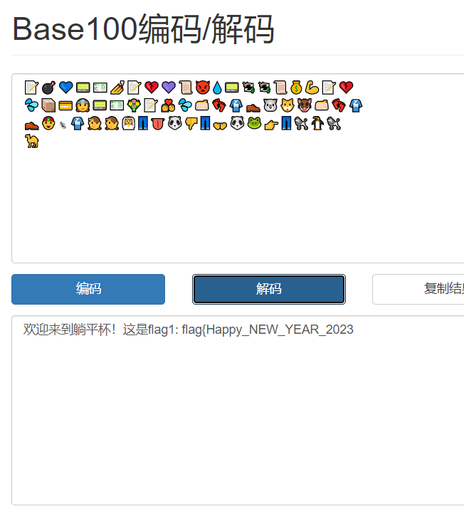


# 躺平flag提取器

先查壳

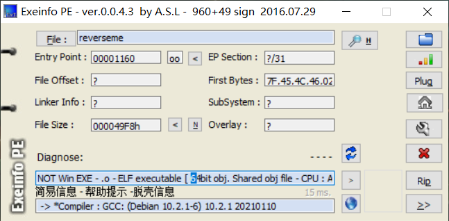

64位elf文件，有点烦人，得用ida，不能动态调试

打开ida,按下Tab键查看伪代码

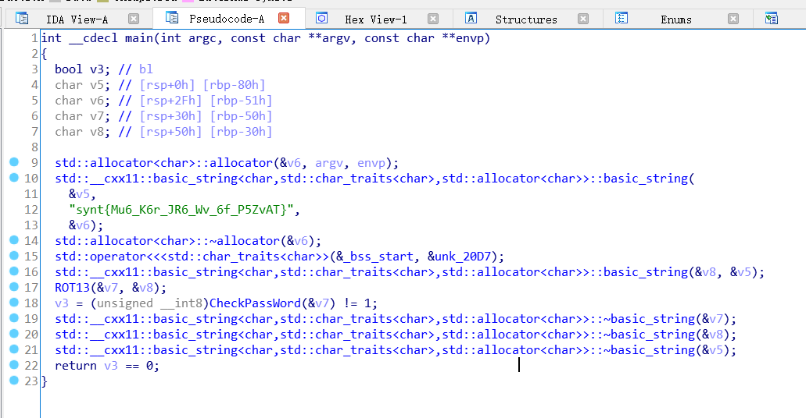

直接就看到一个字符串，这个字符串可能是由某一个flag通过某些算法捣鼓出来的。下面的伪代码看着就头大，但是有一个CheckPassWord函数引起了我的注意,点开看看。

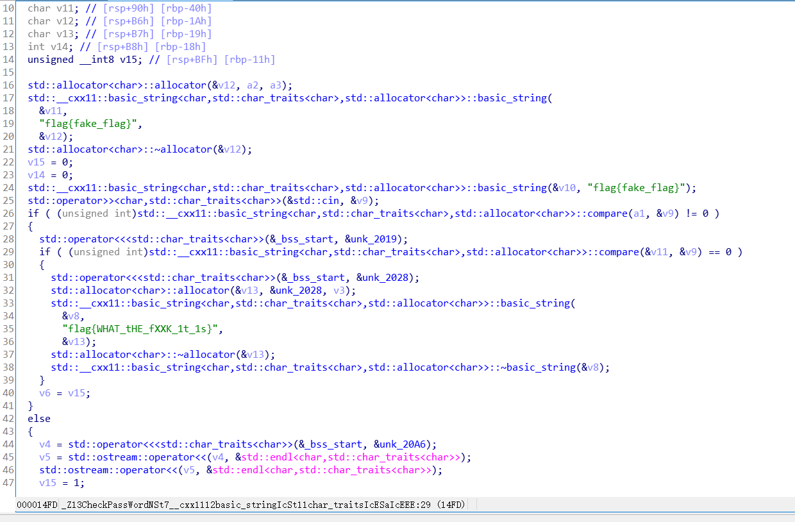

找到了第一个flag

flag{WHAT_tHE_fXXK_1t_is}

第二个flag应该就是由最开始看到的那个字符串算出来的，再看看ROT13函数,那么长看着就头大，但是这个算法应该是类似于替换式算法，很显然，synt{Mu6_K6r_JR6_Wv_6f_P5ZvAT} 前四个字母就对应着"flag"这四个字母。网上查一查有没有这个密码解码器，一查果然有。

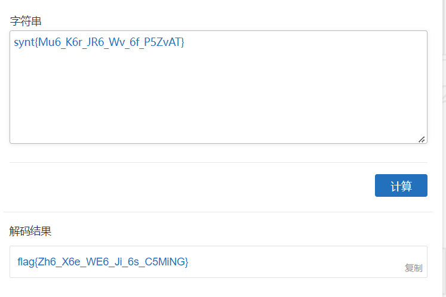

这个80%就是答案了，结果交上去不对……
然后提示里说别的也被rot13了，也就是说那些数字也得换掉，再仔细看看代码

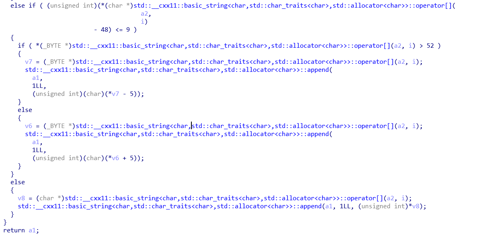

这一部分就是对数字的变换了，仔细分析一下，这段代码的意思就是ASCLL大于52（也就是说大于4)的时候这个数字要减去5，否则就要加上5，那么“6”就变成了“1”，“5”变成了“0”。最后的flag就是

flag{Zh1_X1e_WE1_Ji_1s_C0MiNG}

# 躺平flag提取器  极速版 

安卓逆向

使用工具：
* jadx_gui 
* MT管理器  (在模拟器里使用)
* IDA

首先把apk文件移动到模拟器里，安装运行，点击 flag1看看

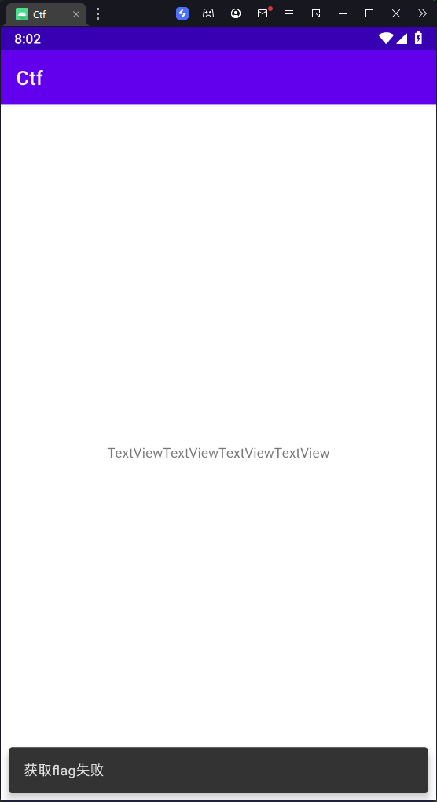

然后在本机上用jadx_gui打开apk文件,搜索“获取flag”然后就找到了flagActivity1关键代码

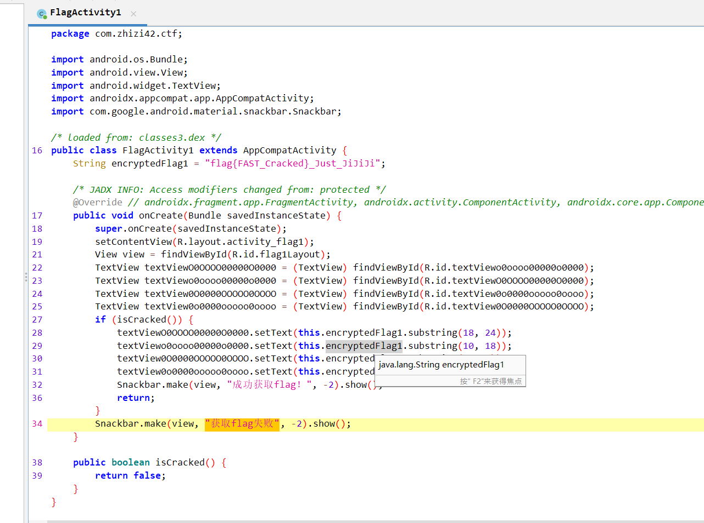

显然，我们只需要爆破isCracked这个函数就能成功了，将原先的false变成true就可以了。

在模拟器里打开MT管理器，提取安装包，搜索到关键代码，然后把
```const/4 v0 0x0```改成```const/4 v0 0x1```然后再安装运行新的apk文件，于是第一个flag就得到了

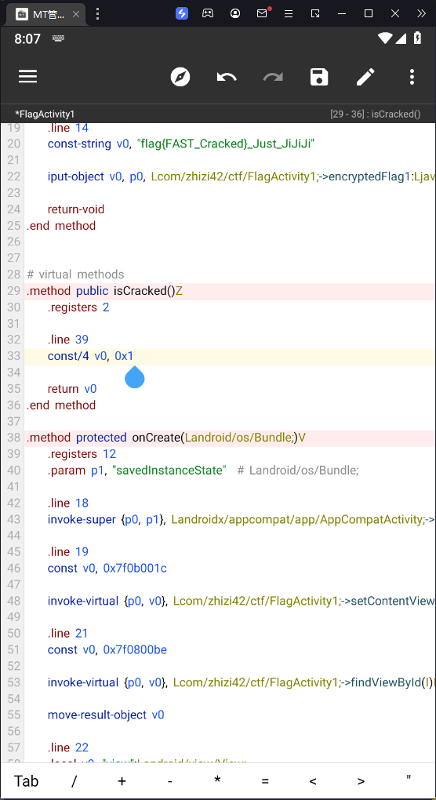


第二个flag的话一开始没有眉目，就想着进jadx_gui看看,结果真的找到了flagActivity2。

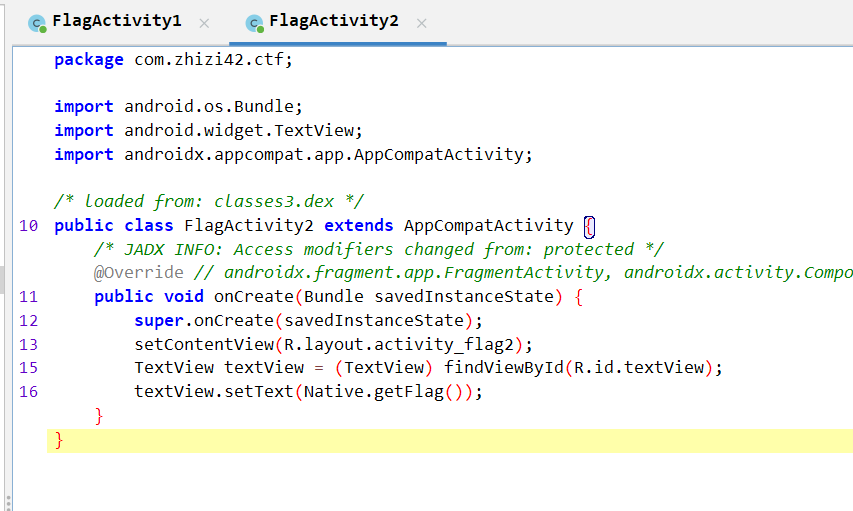

我学习安卓逆向没有太长时间，一开始觉得这个getFlag()函数肯定有点东西，结果发现点不开，于是把这上面的各个函数挨着搜了一遍，发现都是系统函数，不是关键代码。但是当我在网上搜的时候偶然发现带着Native的函数应该是是写在lib里面的so文件的，这个文件是可以用IDA反编译的。

于是我把apk文件解压，脱出libmain.so文件，然后用IDA反编译

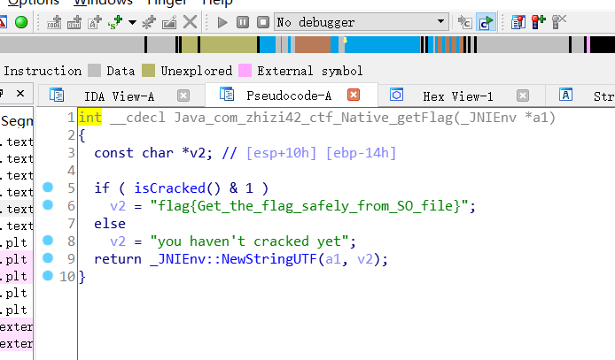

第二个flag就得到了